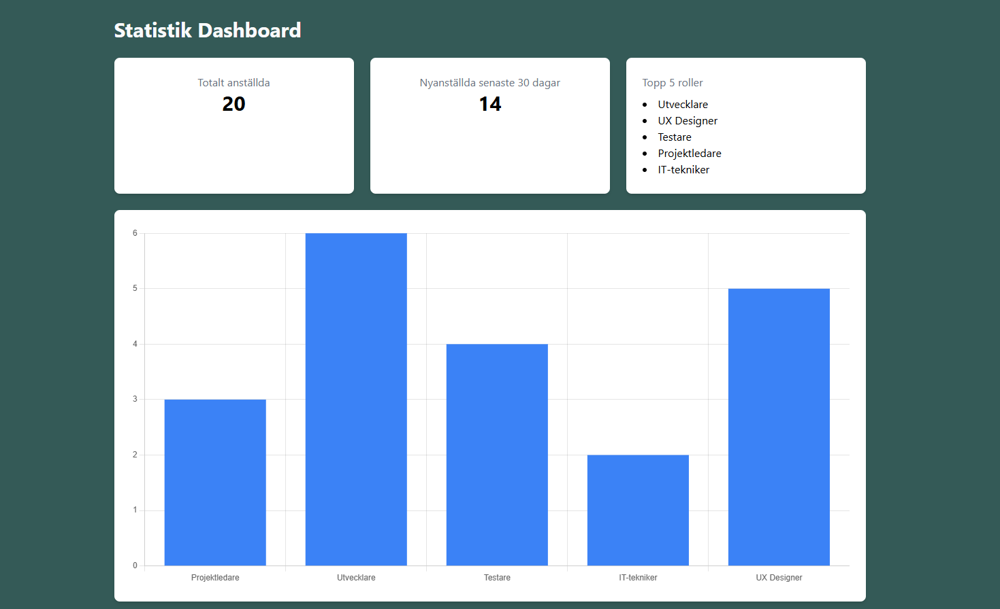
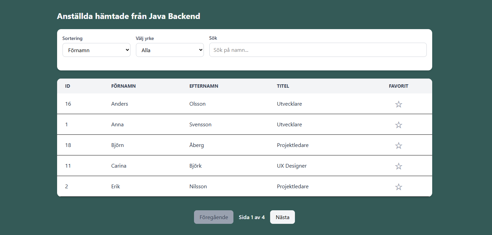
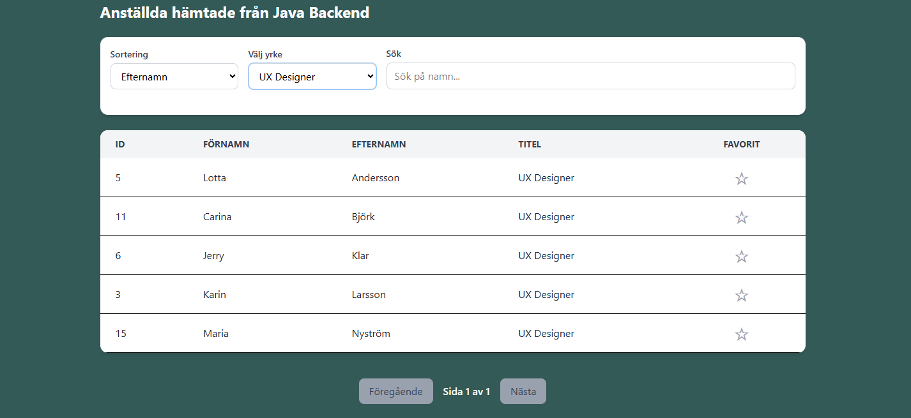
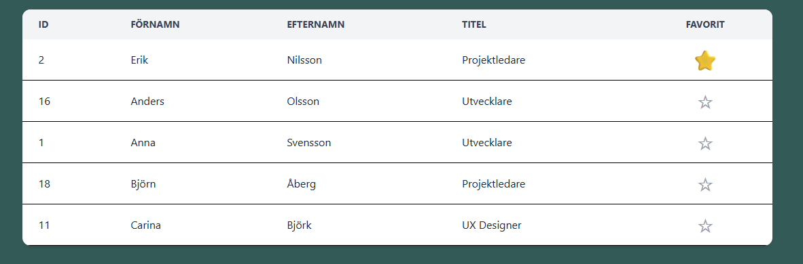

# Demo Project - Vue & Java

## Tech stack

- HTML5
- Tailwind CSS
- Vue.js
- TypeScript
- Vite
- ESLint
- Java
- Spring Boot
- MySQL

## About this project

This project was created for the purpose of practicing Vue and Java together, as a headless API. The focus of this project is not on design, but rather on functionality.

## Screenshots

Here is a dashboard, created with Chart.js, to display the number of employees, newly hired employees in the last 30 days, and the top 5 job roles.

The employee table with sorting functions and pagination.

The look when it's sorted.

When an employee is set as a favorite, it will land at the top of the table.

## Author

[@CarolineVarsaga](https://www.github.com/CarolineVarsaga)
